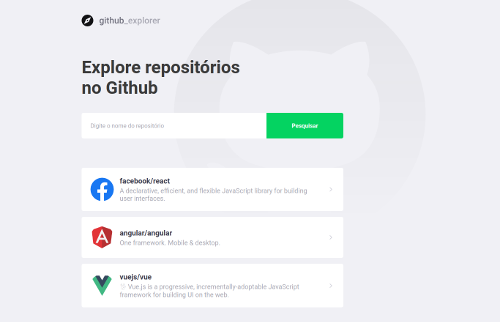

# Github Explorer

Simple ReactJS project to locally save a list of Github repositories and show some stats.




## 📋 Probable Roadmap
- search by user
- search by repo without the need of the username
- save the list somewhere


## 💻 Local install
1. Clone the application

```
$ git clone git@github.com:cleiver/GoStack11-Github-Explorer.git
```

2. Install dependencies

```
$ yarn
```

3. Start the server

```
yarn start
```
